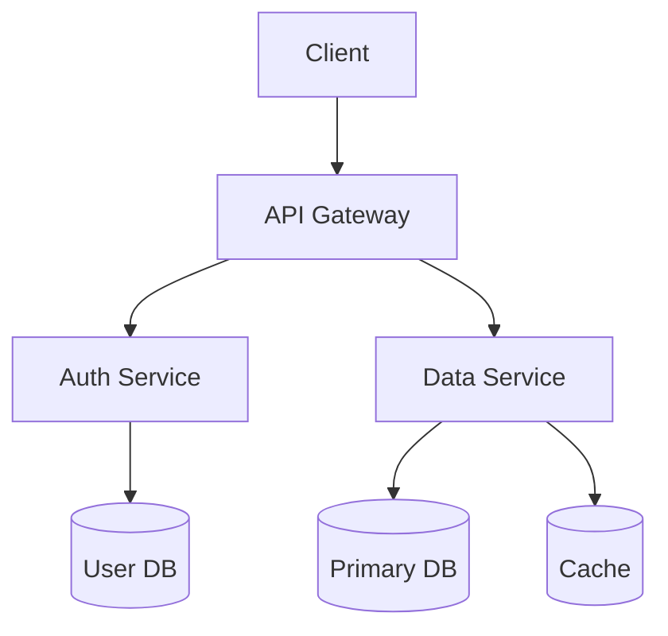
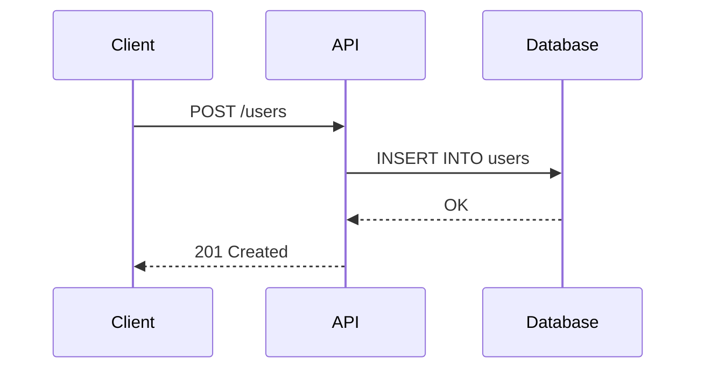
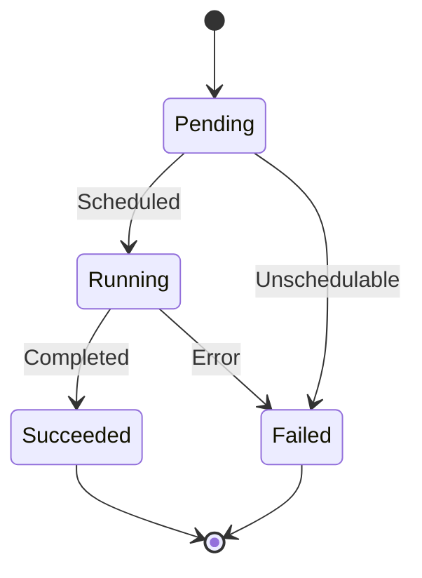
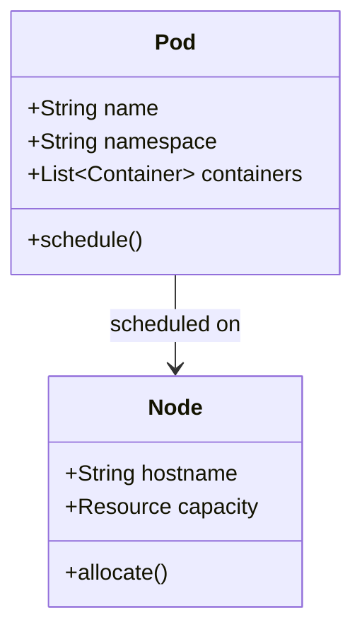
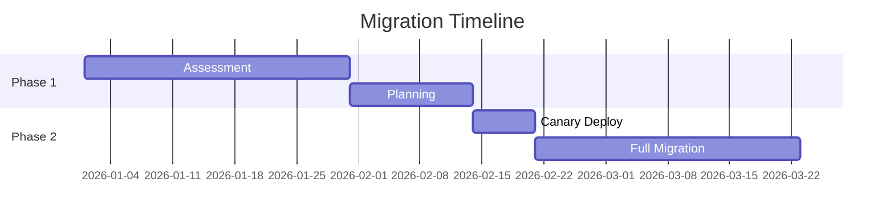
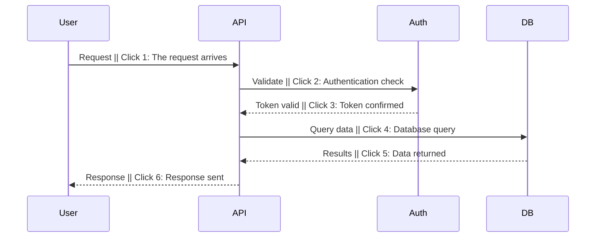

# Diagrams

A good diagram replaces 3 slides of text. A bad diagram replaces comprehension with confusion.
Use Mermaid (built into Slidev). Decide when a diagram helps, and when text is better.

## When to Use a Diagram

Use a diagram when:
- Relationships between components matter (architecture, data flow)
- State transitions are important (lifecycles, state machines)
- Sequences matter (API calls, request flows)
- Hierarchies exist (inheritance, nesting, dependencies)
- You're comparing structures (before/after architecture)

Use text when:
- The concept is simple enough for a sentence
- The audience doesn't need to understand the relationships (just the outcome)
- The diagram has more than 8 nodes (too complex for a slide)

## Mermaid Diagram Types

### Flowchart (architecture, dependencies)

Use `graph TD` (top-down) for architectures. Use `graph LR` (left-right) for pipelines.

### Sequence Diagram (API flows, protocols)

Use sequence diagrams when the ORDER of operations matters.

### State Diagram (lifecycles, state machines)

State diagrams are the clearest way to explain lifecycles. Every Kubernetes talk should have one.

### Class Diagram (object models)

Use sparingly. Class diagrams are dense. Only for OOP or data model talks.

### Gantt Chart (timelines, roadmaps)

## Size Constraints

Diagrams must be readable from the back of a conference room.

| Diagram nodes | Max scale | Notes |
|--------------|-----------|-------|
| 1-3 nodes | `{scale: 1.0}` | Full size, clear |
| 4-5 nodes | `{scale: 0.8-0.9}` | Slightly reduced |
| 6-7 nodes | `{scale: 0.65-0.75}` | Getting tight |
| 8+ nodes | `{scale: 0.5-0.6}` | Consider splitting into two diagrams |

If a diagram needs `{scale: <0.5}` to fit, the concept is too complex for one slide.
Split it, or show a simplified version with a link to the full diagram.

## Diagram Colors

- Background: match slide background or slightly lighter/darker
- Primary nodes: neutral (gray/white), letting the accent stand out
- Key node: use the deck's accent color on the ONE most important node
- Status nodes: use semantic colors (green=success, red=error) only on terminal states
- Box borders: subtle, 1px, never dominate the fill
- Text inside nodes: full contrast (4.5:1 minimum against fill)

## Annotation

Diagrams need narration. Don't just put a diagram on a slide and move on.

Best approach: use click steps to walk through the diagram piece by piece.
For Mermaid, use `|` in sequence diagrams:

Alternative: put explanation text to the side using `two-cols` layout.

## Anti-Patterns

- More than 8 nodes in a diagram (unreadable at projection size)
- No walkthrough (dumping a complex diagram without click steps)
- Text inside nodes that's too small (font scales with `{scale}` — smaller diagram = smaller text)
- Color-only meaning (red node = bad, but no label explaining why)
- Using a diagram when a sentence would do (over-diagramming)
- Low contrast between node fill and text
- Unlabeled arrows or connections
