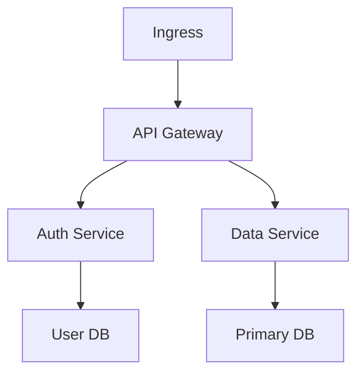

# Slide Layout Patterns

Every slide has one job. When a slide tries to do two things, split it.
This reference covers the common patterns for technical presentations.

## The One-Idea Rule

A slide communicates ONE idea. The title names the idea. The content explains it.
If you find yourself writing two headings, you need two slides.

Test: cover the content. Can someone read only the title and know the point?
If not, the title is too vague or the slide is doing too much.

## Base Grid (1920x1080)

```
┌──────────────────────────────────────────────┐
│  64px padding                                 │
│  ┌────────────────────────────────────────┐  │
│  │  Title (48-72px)                       │  │
│  │                                         │  │
│  │  Content area                           │  │
│  │  Max 65 chars/line                      │  │
│  │  Max 6 lines body                       │  │
│  │                                         │  │
│  │                                         │  │
│  │  Presenter: name, date, slide # (bottom)│  │
│  └────────────────────────────────────────┘  │
│  64px padding                                 │
└──────────────────────────────────────────────┘
```

## Layout Cheat Sheet

| Layout | Use for | Avoid |
|--------|---------|-------|
| `default` | Title + content. Your workhorse. Most slides. | Don't use for >3 consecutive slides |
| `two-cols` | Code + explanation. Before/after. Comparison. | Don't make columns asymmetrical without reason |
| `center` | Big statement. Single metric. Call to action. | Don't use for multi-paragraph content |
| `section` | Topic transitions. Deck navigation. | Don't put body content on a section slide |
| `image-right` | Architecture diagram. Screenshot + explanation. UI walkthrough. | Image must be readable at projection size |
| `cover` | Hero/opening. Conference name. Author. | Only once per deck |
| `quote` | Customer quote. Industry stat. Testimonial. | Attribution must be visible |
| `fact` | Single statistic. Counter-intuitive data point. | Make sure the number is the focus |

## Pattern: Code + Explanation

The most common pattern in technical talks. Use `two-cols`.

```md
---
layout: two-cols
---

# Title

One sentence of context. What does this code do and why does it matter?

<v-click>

Key observation about the code.

</v-click>

::right::

```python {1-4|6-8}
def schedule_pod(name, ns):
    pod = client.V1Pod(
        metadata={"name": name}
    )
    return api.create_pod(ns, pod)

result = schedule_pod("web", "prod")
print(f"Scheduled: {result.metadata.name}")
```
```

## Pattern: Architecture Diagram + Walkthrough

```md
---
layout: image-right
image: ./assets/architecture.png
---

# System Architecture



Three zones: edge, control, data. Each scales independently.
```

## Pattern: The Big Reveal (data/stat)

```md
---
layout: center
---

# 3.2x

Faster cold starts with lazy module loading

<span class="text-sm muted">vs v2.1 baseline • p99 across 10k deploys</span>
```

## Pattern: Section Breaks

Use between major topic changes. Gives the audience a mental reset.

```md
---
layout: section
---

# Part 3: Production Lessons
```

After a section slide, the next slide can reintroduce the topic at a lower detail level.

## Pattern: Before/After

```md
---
layout: two-cols
---

# Before: Serial Pod Creation

```python
for name in pod_names:
    create_pod(name)
```

30 seconds for 50 pods.

::right::

# After: Concurrent Creation

```python
with ThreadPoolExecutor() as pool:
    pool.map(create_pod, pod_names)
```

2.1 seconds for 50 pods.
```

## Layout Variety

- Never use the same layout more than 3 slides in a row.
- Section slides reset the variety counter.
- `default` layout is correct for ~60% of slides. `two-cols` for ~20%. The rest use other layouts.
- If you find yourself using only `default`, you're missing opportunities for visual variation.

## Spacing

- Padding: 64px minimum on all sides within a slide (except full-bleed layouts like `cover`).
- Content width: roughly 2/3 of slide width for body text. Full width for diagrams and code.
- Between title and content: 24-32px gap.
- Between paragraphs: 16-24px gap.
- Scale spacing proportionally with font size. Larger text = larger gaps.

## Footer

Slidev's default theme includes a footer area. Use it for:
- Presenter name
- Conference name + date
- Slide number (auto)
- Company logo (if brand deck)

Footer text should be 14-16px, low contrast but still readable.
