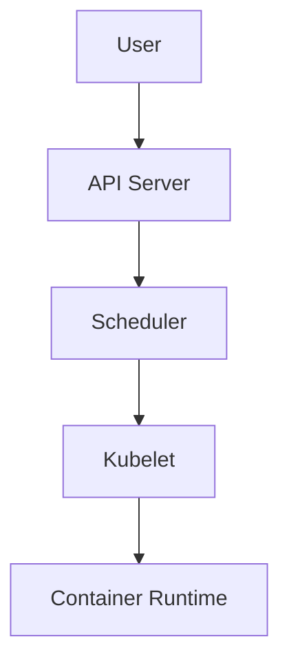
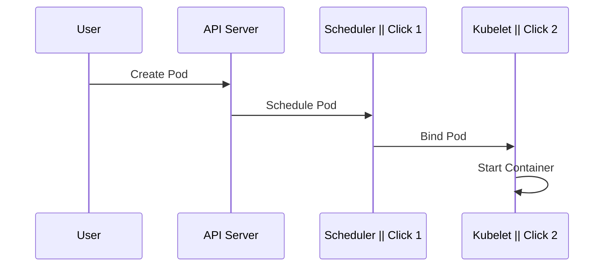

# Slidev Syntax & Features

> Full docs at sli.dev. This reference covers the 80% of features used in 95% of technical presentations.

## File Format

Slidev slides are a single Markdown file with `---` as slide separators.

```md
---
theme: ./theme/styles.css
highlighter: shiki
---

# First Slide

Content here. Separate slides with `---`.

---

# Second Slide

Second slide content.
```

## Frontmatter (Per-Deck)

At the top of `slides.md`, between `---` fences:

```yaml
---
theme: ./theme/styles.css        # Path to generated theme
title: Kubernetes Pod Lifecycle  # Browser tab title
highlighter: shiki               # shiki (default) or prism
lineNumbers: true                # Show line numbers on code blocks
drawings:
  persist: false                 # Drawing annotations persist across slides?
exportFilename: my-talk          # Base filename for exports
---
```

## Frontmatter (Per-Slide)

Layout and behavior for individual slides:

```yaml
---
layout: two-cols
class: text-sm
---
```

### Common per-slide options

| Option | Values | Effect |
|--------|--------|--------|
| `layout` | `default`, `two-cols`, `center`, `image-right`, `image-left`, `full`, `quote`, `statement`, `fact`, `cover`, `section`, `none` | Slide layout |
| `class` | CSS class names | Additional styling |
| `transition` | `fade`, `slide-left`, `slide-up`, `none` | Slide transition |
| `clicks` | number | Number of click steps on this slide |
| `clicksStart` | number | Offset for click animation numbering |

## Layouts

### `default` — Title + content
Most common. Title at top, content below. Good for most technical slides.

```md
---
layout: default
---

# The Problem

Pod scheduling is slow at scale because...
```

### `two-cols` — Split view
Two equal columns. Use `::right::` divider.

```md
---
layout: two-cols
---

# Kubernetes API

The API server is the front door to the control plane.

::right::

```python
from kubernetes import client
v1 = client.CoreV1Api()
pods = v1.list_pod_for_all_namespaces()
```
```

### `center` — Focused impact
Centered content. Good for single statements, big numbers, calls to action.

```md
---
layout: center
---

# 99.99%

Uptime across all regions

[Get started →](https://example.com)
```

### `section` — Topic transitions
Centered section title. Use between major topic changes.

```md
---
layout: section
---

# Part 2: Implementation
```

### `image-right` / `image-left`
Content on one side, image on the other.

```md
---
layout: image-right
image: ./assets/architecture.png
---

# System Architecture

The control plane runs in three zones.
```

### `cover` — Hero/opening slide
Full-bleed opening. Large title, subtitle, author.

```md
---
layout: cover
---

# Kubernetes Pod Lifecycle

From Pending to Terminated

**Deanna • KubeCon 2026**
```

## Click Animations

Reveal items one at a time during presentation.

### Per-element: `<v-clicks>`

```html
<v-clicks>

- First point appears
- Second point appears
- Third point appears

</v-clicks>
```

### Per-item: `v-click`

```md
<v-click>

This text appears on the first click.

</v-click>

<v-click>

This text appears on the second click.

</v-click>
```

### Click counting

```md
<div v-click="1">Appears on click 1</div>
<div v-click="2">Appears on click 2</div>
<div v-click="3">Appears on click 3</div>
```

### v-after (appears with previous)

```md
<div v-click>First item</div>
<div v-after>Appears alongside first item</div>
```

## Code Features

### Syntax highlighting
Always specify the language:

```md
```python {1-3|5|7-9|all}
def schedule_pod(name, namespace):
    pod = create_pod_spec(name)
    # Lines 1-3 highlighted first

    scheduler.assign_node(pod)
    # Line 5 highlighted second

    api.create_namespaced_pod(
        namespace=namespace,
        body=pod
    )
    # Lines 7-9 highlighted third
```
```

Click through to highlight different lines as you explain them.

### Monaco Editor
Interactive code editor for live demos:

```md
```ts {monaco}
function fibonacci(n: number): number {
    if (n <= 1) return n;
    return fibonacci(n - 1) + fibonacci(n - 2);
}
```
```

### Monaco Runner (execute code)
```md
```ts {monaco-run}
console.log("Hello from the editor!");
```
```

### TwoSlash (TypeScript type annotations)
```md
```ts twoslash
const x = [1, 2, 3]
//    ^?
```
```

### Code max-height
Long code blocks with scroll:
```
```ts {maxHeight:'300px'}
// Long code here
```
```

## Diagrams

### Mermaid (built-in)
```md

```

Mermaid supports: `graph TD/LR`, `sequenceDiagram`, `stateDiagram-v2`, `classDiagram`, `flowchart`, `gantt`, `pie`, `erDiagram`.

Use `{scale: 0.7}` or lower for complex diagrams to fit on screen.

### Mermaid with click steps

Use `|` in Mermaid to control sequence diagram build steps:

```md

```

## Components

Built-in Vue components for richer slides.

### Tweet / YouTube embeds
```md
<Tweet id="1234567890" />
<Youtube id="abc123" />
```

### Styling
```md
<style>
h1 {
  color: var(--slidev-accent);
}
</style>
```

Scoped to the current slide by default.

## Presenter Notes

HTML comments at the end of a slide become presenter notes (visible only in presenter mode):

```md
# My Slide

Content visible to audience.

<!--
This is a presenter note. Only you see this.
Explain the motivation behind this architecture choice.
Mention that this pattern was adopted in Q3 2025.
-->
```

Every slide must have presenter notes. Notes explain *what to say*, not *what's on the slide*.

## Exporting

See `references/export.md` for full export documentation.

## Resources

- Full docs: https://sli.dev
- Theme gallery: https://sli.dev/resources/theme-gallery
- Showcases: https://sli.dev/resources/showcases
