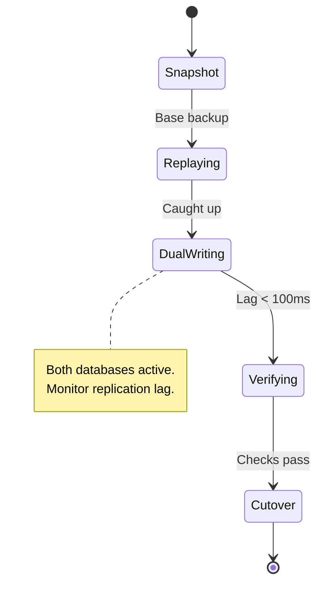

---
layout: cover
---

# Zero-Downtime PostgreSQL Migrations

How we moved 8TB without dropping a single connection

**Deanna · KubeCon 2026**

---
layout: section
---

# Part 1: The Migration Problem

---

# Why Migrations Fail

Database migrations are the hardest part of infrastructure work.
The database is stateful, and state is scary.

<v-clicks>

- **Downtime is not an option** — 8TB takes hours to copy
- **Replication lag** — the replica is always behind
- **Schema drift** — production moves while you're copying
- **Connection storms** — cutover can overwhelm connection pools

</v-clicks>

<!--
Frame the problem. Everyone in the room has felt this pain.
Emphasize that we're talking about production databases with
real traffic — not dev environments.
-->

---
layout: two-cols
---

# The Dual-Write Pattern

Write to both databases during the migration window.
The application doesn't know which one is primary.

<v-click>

```python
async def dual_write(query, params):
    old = await old_db.execute(query, params)
    new = await new_db.execute(query, params)
    return old  # read from old until cutover
```

</v-click>

::right::

```mermaid {scale: 0.65}
graph TD
    A[Application] --> B[Dual Writer]
    B --> C[(Old Primary)]
    B --> D[(New Primary)]
    B --> E[Replication Check]

    style E fill:oklch(20% 0.01 260),stroke:oklch(68% 0.22 260),color:oklch(93% 0 0)
```

<!--
Walk through the dual-write architecture.
The key insight: the application never talks directly to either database.
The dual writer is the single point of truth.
-->

---
layout: default
---

# Migration State Machine



<!--
This is the core mental model. Each state has specific
acceptance criteria before moving to the next.
Don't skip verification — that's how you get corruption.
-->

---
layout: center
---

# 0

Downtime seconds during the 8TB cutover

<span class="text-sm">p99 latency increased by 12ms during dual-write window</span>

---
layout: section
---

# Part 2: The Tooling

---

# What We Built

<v-clicks>

- `pg-shuttle` — the dual-write proxy that sat between our app and both databases
- `pg-verify` — a checksum validator that compared every row across both databases
- `pg-cutover` — the atomic cutover script that swapped primaries in under 100ms

All open source. All tested on our own production first.

</v-clicks>

<!--
Mention that pg-shuttle is available at github.com/our-org/pg-shuttle.
This is the call-to-action moment — give people the tools.
-->

---
layout: default
---

# Try It Yourself

```bash
# Install pg-shuttle
$ brew install our-org/tap/pg-shuttle

# Run a dry-run migration
$ pg-shuttle migrate \
    --source postgres://old:5432/mydb \
    --target postgres://new:5432/mydb \
    --dry-run

# When you're ready
$ pg-shuttle migrate \
    --source postgres://old:5432/mydb \
    --target postgres://new:5432/mydb \
    --cutover
```

<p class="text-sm" style="margin-top:28px">
  Docs: github.com/our-org/pg-shuttle · Questions? Find me after the talk
</p>

<!--
End with executable code. People should be able to copy-paste
and try it. This is the most important slide in the deck.
-->
