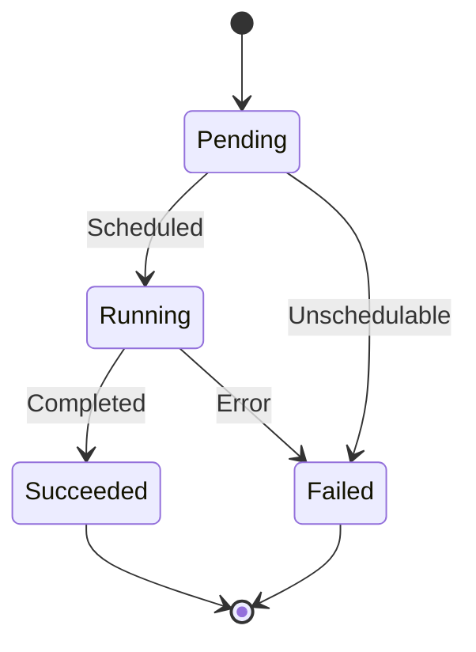

---
layout: cover
---

# Kubernetes Pod Lifecycle

From Pending to Terminated — what actually happens

**Deanna · KubeCon 2026**

---
layout: section
---

# Part 1: The Problem

---

# Pod Scheduling at Scale

When you run `kubectl apply`, a lot happens before your container starts.
Most of it is invisible, and most of it can fail silently.

<v-clicks>

- The API server validates and persists the Pod spec
- The scheduler finds a node (or doesn't)
- The kubelet pulls images and starts containers
- Any step can fail without a clear signal

</v-clicks>

<!--
This is the setup slide. We're establishing the problem space.
Mention that most Kubernetes users have debugged a CrashLoopBackOff
at 2am. That's what we're going to fix.
-->

---
layout: two-cols
---

# The Scheduling Loop

The scheduler runs a continuous reconciliation loop.
It watches for unscheduled pods and assigns them to nodes.

<v-click>

1. Watch for `Pod.spec.nodeName == ""`
2. Filter feasible nodes
3. Score and rank candidates
4. Bind pod to best node

</v-click>

::right::

```go {1-5|7-9|11-13}
// The main scheduling loop
for {
    pod := nextPod()
    if pod == nil {
        time.Sleep(1 * time.Second)
        continue
    }

    nodes := feasibleNodes(pod)
    bestNode := scoreNodes(nodes)

    bindPod(pod, bestNode)
}
```

<!--
Walk through this slowly. The loop structure is the key insight
most people miss — it's a continuous loop, not a one-shot operation.
-->

---
layout: default
---

# Pod State Machine



<!--
Walk through each state. Emphasize that Pending is the only phase
where scheduling decisions happen. Once Running, the pod stays
Running until it exits or fails.
-->

---
layout: center
---

# 3.2x

Faster cold starts with lazy module loading

<span class="text-sm">vs v2.1 baseline · p99 across 10k deploys</span>

---
layout: section
---

# Part 2: The Solution

---
layout: default
---

# Next Steps

<v-clicks>

- Try this pattern in your own cluster: `kubectl apply -f example.yaml`
- Read the full proposal: [github.com/kubernetes/enhancements](https://github.com/kubernetes/enhancements)
- Join the SIG scheduling meeting: **Thursdays at 10am PT**
- Questions? Find me at the hallway track or open an issue

</v-clicks>

<!--
End with a clear call to action. Don't let the talk fade out.
Give people something to do tomorrow.
-->
